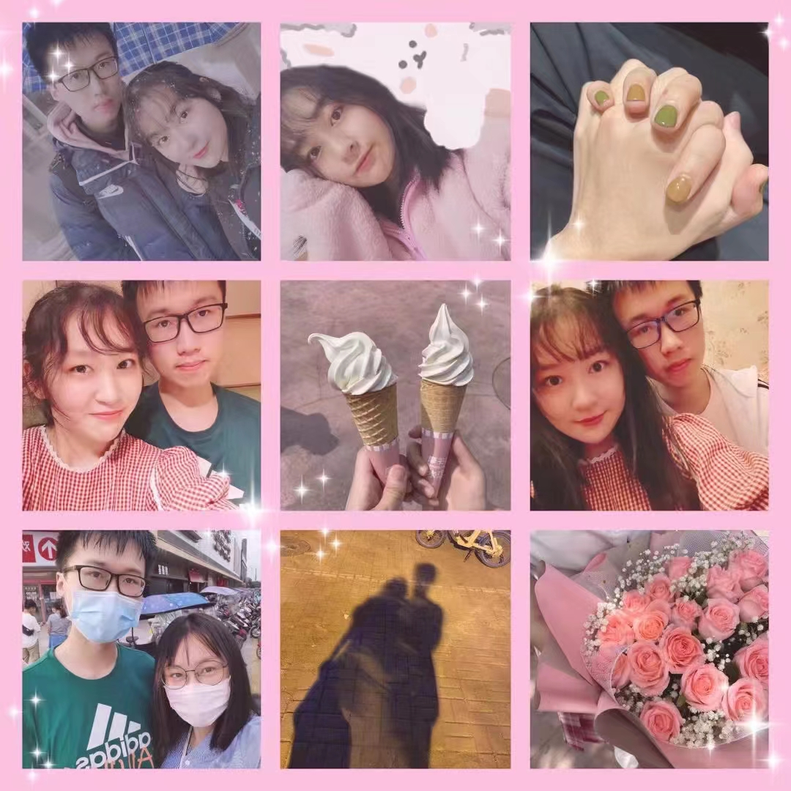
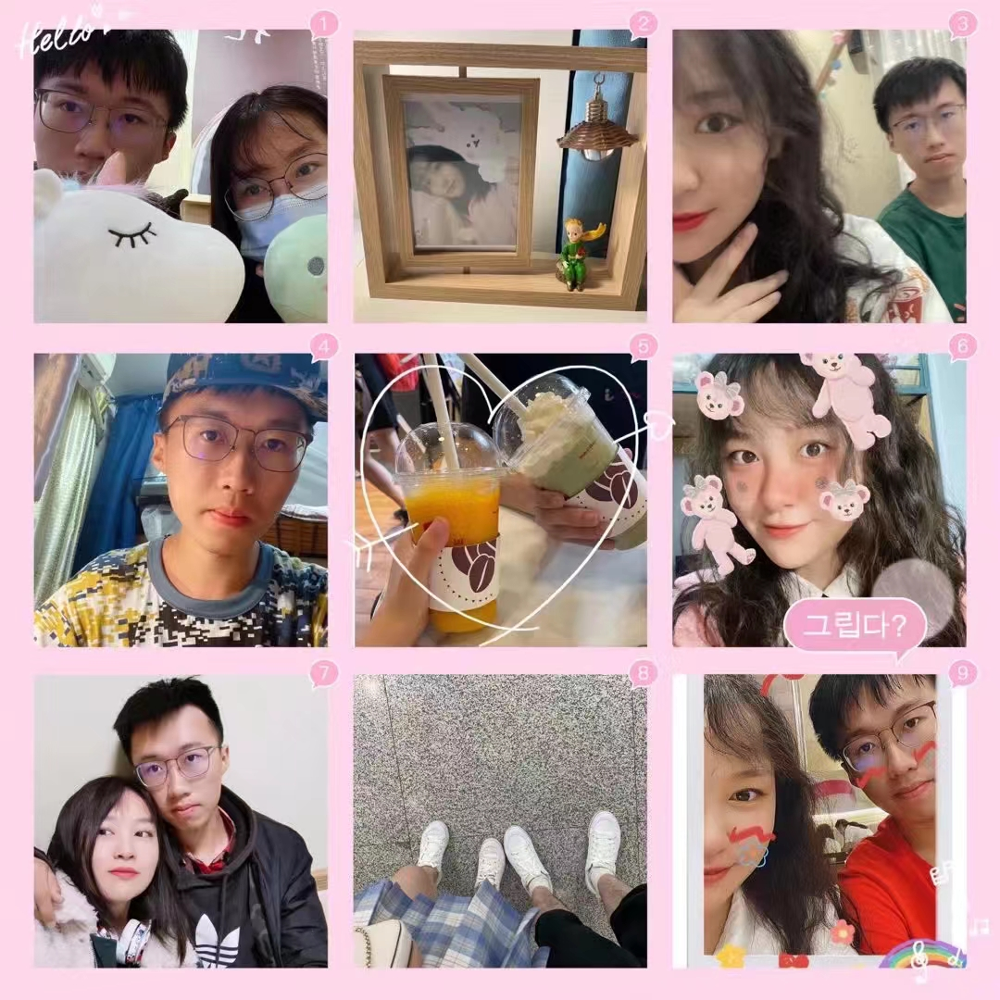
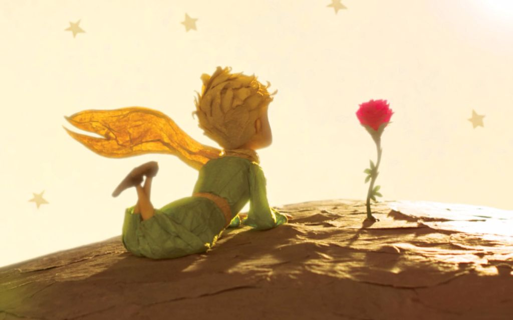

# 写在前面（开工大吉）

### 2021.11.03

Welcome back home！

我和小可拥有Personal Web和个人Blog的第一天，我相信，如果把每一天的工作和生活都记录在一块砖上，那么终将汇聚成一栋摩天大厦。

此网站暂时托管在github名下，由用户xuleeyoung更新及维护（感情唯有用心经营才会开花结果，网站唯有用心维护方能不断提升 >_< )

网站预留了很多接口方便后续开发更多功能，需要每一天的努力哦，be stronger～

源代码可在xuleeyoung/Blogs仓库发现。

建站Motivation: 随着Wechat/QQ等社交软件过度商业化使用户隐私得不到充分保障，也无法提供具有个性的outlook，同时站主希望应用一些浅薄的前端知识(html, css, javascript)做一些有意义的事情。

希望能通过此网页，记录下每一个值得回忆的瞬间，这里是温暖的港湾，是美好的二人世界(在public之前)。

千里之行，始于足下。万丈高楼也是由一砖一瓦拼接的，而看似朴素却饱含汗水的每一天就是对结果的最大贡献。

随着host的学习，网站的外观以及功能将不断地提升改进～

---

---

第一天就应该更具仪式感，

话不多说，直接上干货...

首先是一封来自曾经的信：

>2020除夕夜
>
>写给小可的：
>
>遥想去年的此情此景，我们合录了一首“明天，你好”，为彼此的未来互相鼓励，还记得是第一次被你表扬我很正能量。过去一年，我们的关系似乎被一次次刷新，从一开始并肩作战的战友，到后来更进一步的“男闺蜜”/斜眼笑终于在2019年9月14日，恰逢中秋，这一天我大概一辈子也不会忘记，我和亲亲亲亲亲爱的小可同学在一起了😝连我自己有时候也不相信，我找到了所谓的真爱，我遇见了我想要一辈子去好好照顾的女孩，就像你最爱的“遇见”里说的那样，遇见你是我最美丽的意外。虽然是异地，虽然我反反复复地怀疑过、挣扎过，但我相信，距离不会成为阻碍我们的理由，所有的一切，都值得等待，美好的事物必须要经历无数挫折也许才能得到吧😌请小可放心，无论我们将来身处何地，我们最终都一定一定会在一起生活。有时候，觉得你是非常非常励志、能给我前进动力的一个人，我也因此更加珍惜你，这是我想要的爱情的模样，帮我找数学题😂给我留言，关心我、心疼我，我也喜欢你 有时候，又特别想在你困难的时候给你帮助，可我总是无意中伤害到你 你一定要原谅我 以后，我一定会把最最最温柔的一面留给你，其实我是多么想能早一天一直陪在你身边，这样我就可以不用在遥远的城市里担心你 请给我时间，只要我们共同努力，相向而行，这一天会早一天到来的，相信我 我们会有属于我们的未来。

**第一年**：

**第二年**：

Host(pig)今天想给hostess(rabbit)的悄悄话：

>Dear honey,
>
>Welcome back home! I have always been here waiting for you. Don't hesitate. I was the one who love you best. The home I built for you is roomy and cosy. It will never be late to tell you—I cherish the every single day together with you. **You are my today and all of my tomorrows.** 
>
>I hate the way you talk to me, and the way you cut your hair. 
>I hate it when you stare.
>I hate the way you read my mind.
>I hate you so much it makes me sick; it even makes me rhyme. 
>I hate it, I hate the way you're always right. 
>I hate it when you lie. 
>I hate it when you make me laugh, even worse when you make me cry. 
>I hate it that you're not around, and the fact that you didn't call. 
>But mostly 
>I hate the way I don't hate you. 
>Not even close, not even a little bit, not even at all.
>
>You look as good as the day I met you.
>
>Yours,
>
>Young

最后，希望这项工程永远永远不要烂尾，forever❤️

