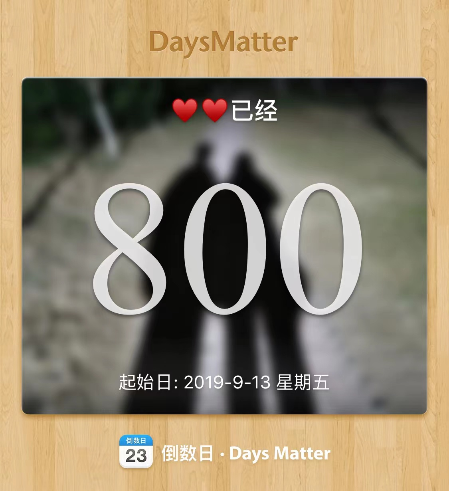
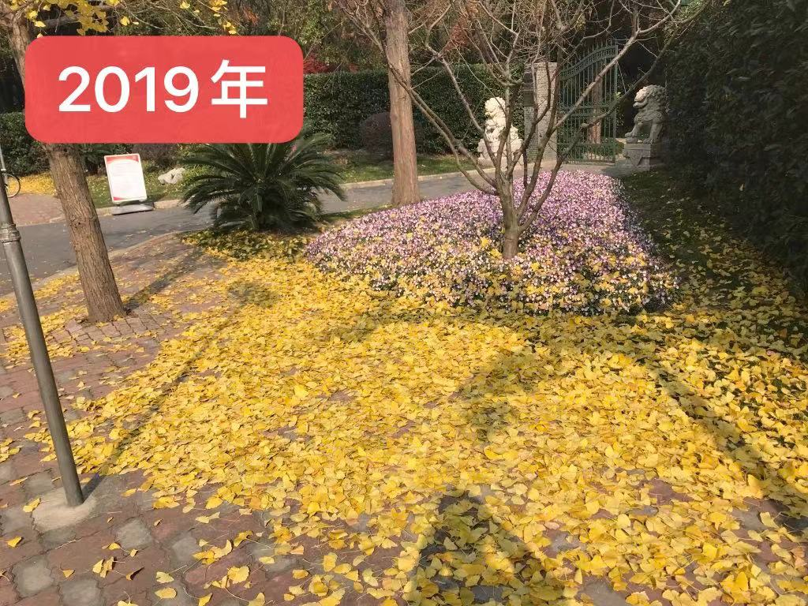
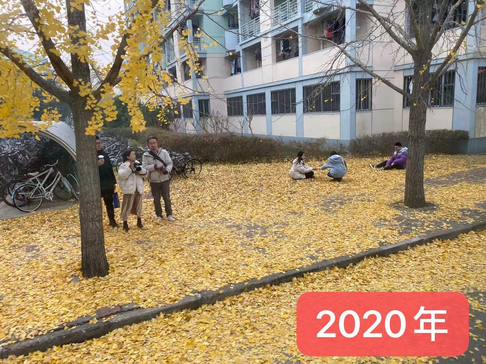

# <center>Home </center>

### 2021.11.22

一寸相思一寸灰

北风凛冽

每当感受到凉意的时候

就会带来思念的感觉

在这种平静的岁月里

未免有些孤寂

可是谁都在默默努力着

为了最喜欢的人做着最喜欢的事

大概是世界上最幸福的事吧

---

吃一个小可的蛋黄酥，

接着工作

寒假要教会可可用git

这样我们就可以互相留言了！

### 2021.11.21

今天其实是一个很特殊的日子

尽管我们都像平常一样 忙碌着各自的事

时间却在不知不觉地流逝

这两天学森路旁的银杏又变得金黄

让我不禁感慨

这已是我们在一起后的第三个深秋

初次相遇的美好却仿佛就在昨天

可其实

每年值此季节都是最难熬的

北风吹不散牵挂

落叶带不走思念

渐渐地我们习惯了这种感受

也积累了耐心

静待来年的春暖花开

我们永远都有理由相信

我们期待的那些花朵

会再次盛开

量子力学的不确定性

推翻了牛顿体系的宿命论

不确定性才是人生的乐趣

也让辛勤换取果实成为可能

未来有很多的机遇在等待

面对不确定的未来

唯有不变的初心

才能够让我们自信

以前我们总是觉得彼此不适合

也因此闹过许多矛盾

但世界上并没有一个能完全与自己相融的人

平行时空里也不存在另一个自己

唯一让她保持那份心动的方式

就是为了自己喜欢的人而改变

---

又想和你喝星冰乐了

又想和你“第二杯半价”了

还有很多没有实现的：

想和你堆雪人

和你拍合影

和你一屋二人三餐四季

和你一起闯出一片天地







用C++写一段代码：

```C++
#define 800th_day srand(time(NULL));
#include "You.h"
class person
{
  private:
  char *name;
  class person *miss;
  class person *love;
  class person *forever;
  
  public:
  bool I_miss_you(class person &someone);
  bool I_love_you(class person &someone);
  bool We_forever(class person &someone);
}

bool I_miss_you(class person &someone){
  this->miss = &someone
}

bool I_love_you(class person &someone){
  this->love = &someone
}

bool We_forever(class person &someone){
  this->forever = &someone
}
void happiness(class person & You, class person & Me)
{
  Me.I_miss_you(You);
  Me.I_love_you(You);
  Me.We_forever(You);
}
```


### 2021.11.21

好歌分享：勇气

终于做了这个决定

别人怎么说我不理

只要你也一样的肯定

我愿意

天涯海角都随你去

我知道一切不容易

我的心一直温习说服自己

就怕你忽然说要放弃

爱真的需要勇气

来面对流言蜚语

只要你一个眼神肯定

我的爱就有意义

我们都需要勇气

去相信会在一起

人潮拥挤我能感觉你

放在我手心 你的真心

---

年轻即是财富

大胆去追梦吧

无论远在天涯

还是近在咫尺

都不及让她遇见更好的自己

### 2021.11.20

今日反思：以后要多笑

### 2021.11.16 

### 一次就好

想看你笑

想和你闹

想拥你入我怀抱

上一秒红着脸在争吵

下一秒转身就能和好


不怕你哭

不怕你吵

因为你是我的骄傲

一双眼睛追着你乱跑

一颗心早已准备好

一次就好 我带你去看天荒地老

在阳光灿烂的日子里开怀大笑

在自由自在的空气里吵吵闹闹

你可知道 我唯一的想要

世界还小 我陪你去到天涯海角

在没有烦恼的角落里停止寻找

在无忧无虑的时光里慢慢变老

你可知道我全部的心跳

随你跳


### 2021.11.15

其实内心很纠结也很愧疚

总想在有限的时间里完成更多的事情

在你最需要我的时候

我总是无法陪伴你身边

想把更多的时间留给你

却往往高估自己规划时间的能力

适得其反

