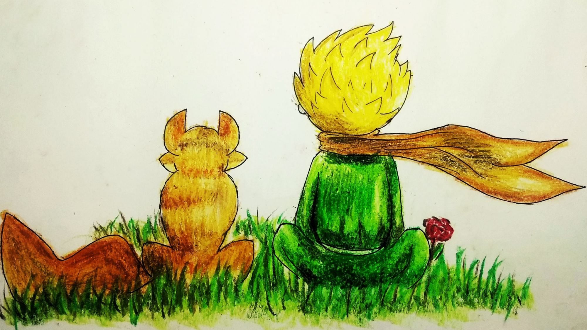
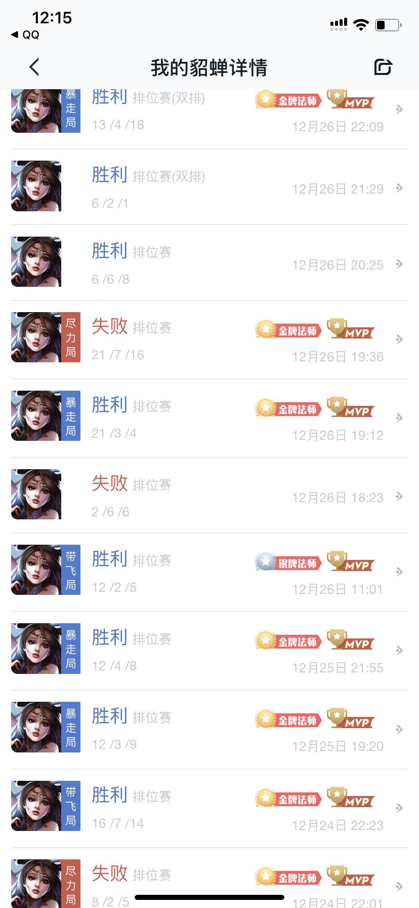
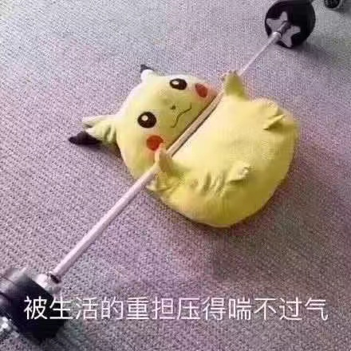
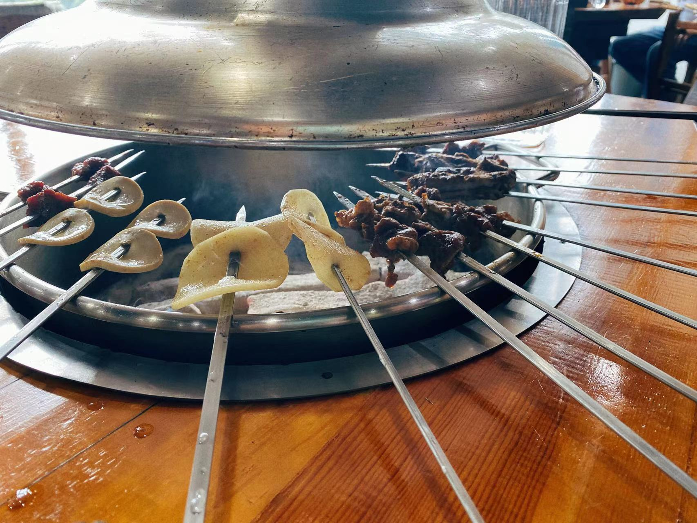
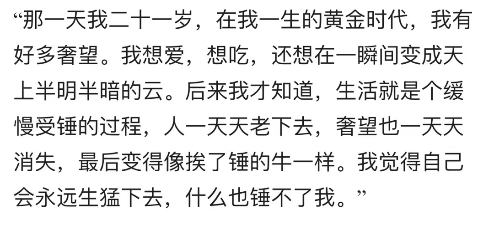
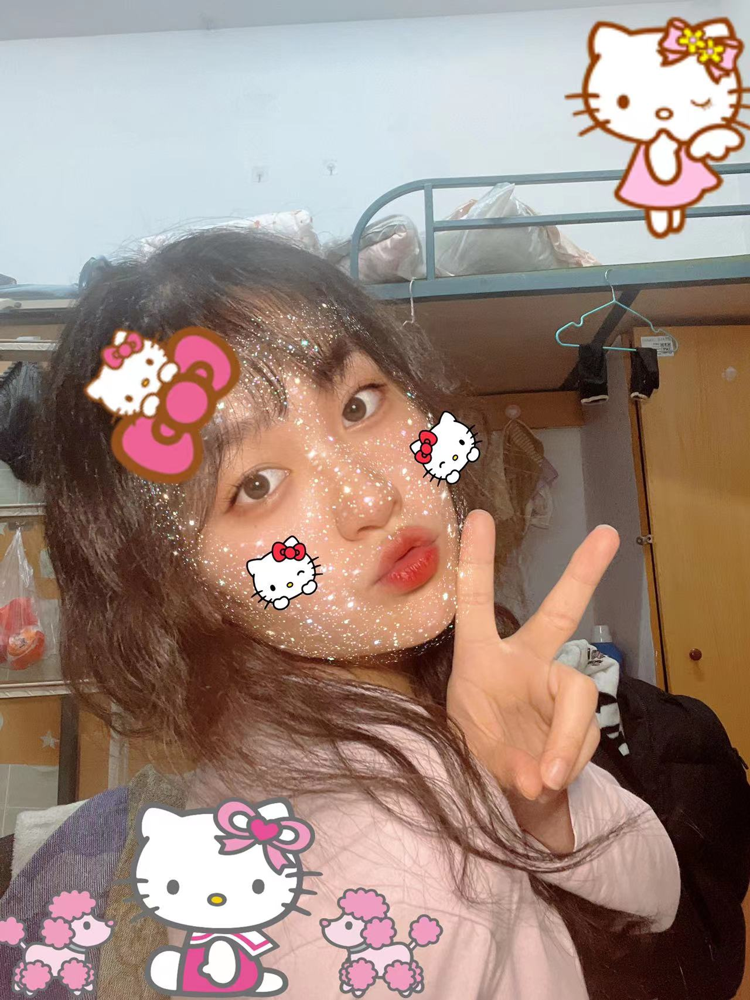
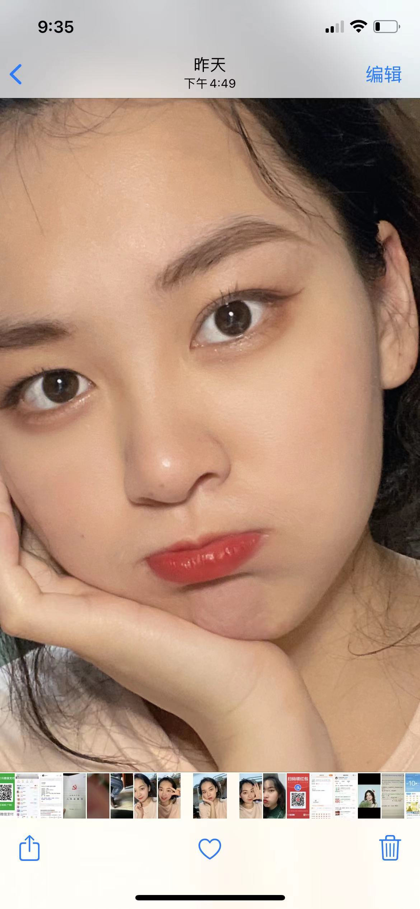
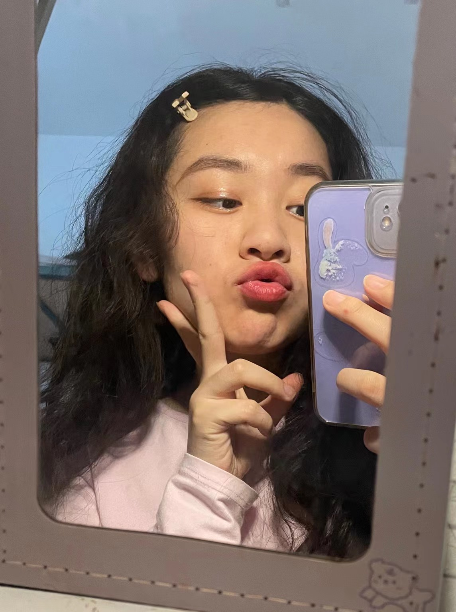
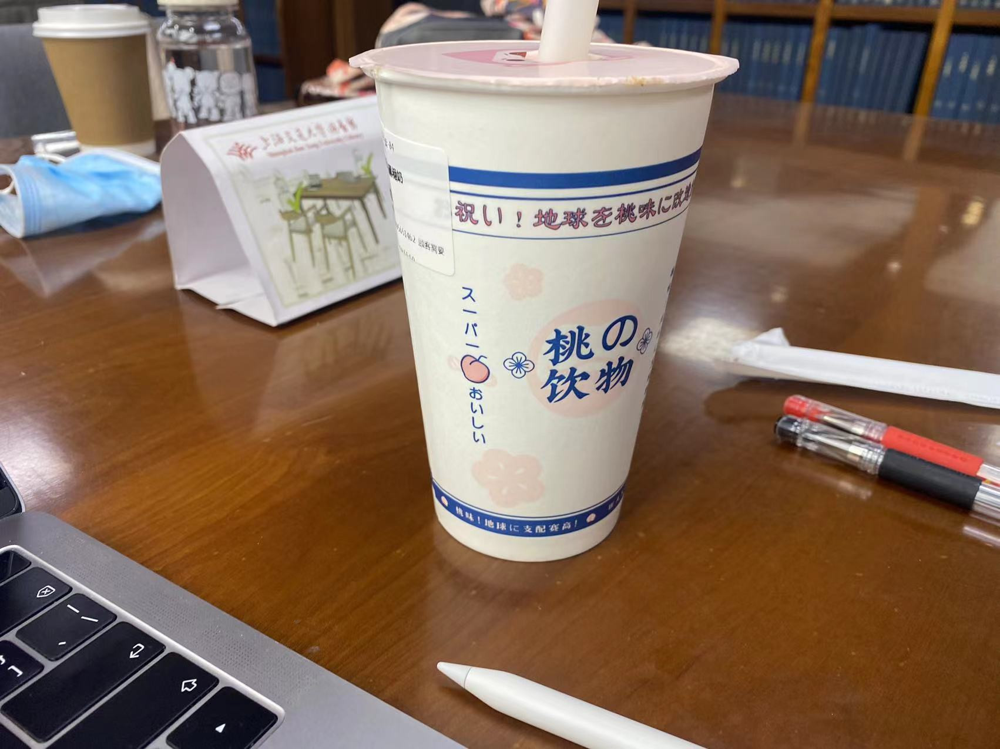

# <center>Home </center>

### 2022.01.29

其实回头才发现

她一直在变好

她也从来没有辜负过你

只是因为你自己太粗心

没有把她的话放在心上

### 2022.01.28

中午突然收到小可的邀约，鸽了姐姐去见小可😊

虽然很匆忙，但还是准时赶到了

电影非常感人，揭露了社会的黑暗也歌颂了父爱的伟大

俗话说，父爱如山

深沉有力，稳重厚实

“你永远不知道一个父亲能够为了自己的孩子做出什么。“


回家路上飘了雪花，风很大

### 2022.01.26

“其实和谁在一起都会吵架，都会闹分手，所以不如把这一生，留给那个，吵了很多次，分了很多次，却依旧不愿离开的人...“ 生活就是一半诗意，一半烟火，手执烟火以谋生，心怀诗意以谋爱。

我们在一起唱的第一首歌是 明天，你好。可是世界上哪有没有什么明天会更好，我们唯一力所能及的，就是过好当下的每一天，人生因为不确定而精彩。即使岁月磨我少年志，时光凉我善良心，总有人间一缕风，填我十万八千梦。

也许爱情最终的模样，就像爱情神话里说的那样，细腻的心意藏在一日三餐里，怦然的心动也只是微微一笑。与生活交手过半生的都市中年人，褪去了年轻人的狂烈奔放，却流露出爱情最本质的映像——陪伴。

> 白老师与李小姐的分，是话中有话的“断舍离”，是互相写好又删掉的言辞。
>
> 白鸽与洋洋的分，是微信拉黑，是说散就散的干脆利落。
>
> 白老师与李小姐的合，是一句犹豫了许久的 “明天一起喝咖啡？”。
>
> 白鸽与洋洋的合，是一个简单的吻。

一壶茶，一锅汤，一幅画，一杯酒。无处不生活，无处不浪漫。

“哪里有什么爱情神话，不过是参差多态。而，参差多态，乃是幸福的本源“

### 2022.01.24

直到如今才发现，我爱你不是因为你完美，我爱你是因为你是你。I love you as who you are. 我爱你，如你所是。无论你有多少的任性和小脾气，我只会包容你，只会记得你的好，只会记得所有幸福的瞬间。

智者，不入爱河。遇你，难做智者。爱意随风起，风止意难平。时光永远不会逆转，我也无法再选择重新遇见你。我们之间那种最纯粹的最真挚的爱，再也无法回头。当新鲜感被耗尽，爱情才刚刚开始。只有当这种至暗时刻来临的时候，一切的功名利禄都变得毫无意义。只有在长夜痛哭过的人，只有百般滋味尝遍的人，才足以谈人生。

今夜放心睡吧，只是再也不能像过去一样相爱了而已，可是不管凌晨几点你打来的电话，我还是会接。

### 2022.01.23

小可：

一直让我迟迟不肯面对也不愿承认的事就是，为什么现在的自己再也无法像当初那样让你着迷了，无论我怎样小心地修复你对我的信任，无论我如何耐心地倾听你的宣泄，我都觉得，我们之间的距离感和陌生感像一堵墙，再也连不通彼此。

很感谢你与我的见面，我本以为，去年暑假的约会已是最后一次，可是它的确是最后一次了。我发现我们不再像曾经一样有很多的话要说，即使见面也只是像老同学一样陌生，想主动靠近你又害怕你难过，短短的几小时，你似乎在向我证明，没有我你过得比以往更好。我真的很难过，我们分别的这五个月，到底经历了什么，让你对我的态度转变成现在这样。

当你说我玩得很菜带你连跪的时候，你想到是谁曾经为了你用你的号连夜打到王者的吗。当你说我的真心只是自我陶醉的深情人设时，你还记得我自责到为你落泪的时候吗。你的每一个情绪的细微变化，都给我一种害怕你离开的惶恐不安，感到不被你理解的纠葛委屈，每当这些情绪交织在一起的时候，我全身都像生病一样冷冰冰的，我还是在暗示自己要忍耐忍耐忍耐。我不知道面对你冷冰冰的话语和坚持要分开的语气时，该如何去温柔以待。这种感觉就像是你从我的头顶浇了一盆冷水。你也许从来不知道，当刀被插进了心里，却还是无能为力地请求你的理解和原谅，是怎样的感觉。

别人都说男生对女生的爱是减分的，而女生对男生的爱却是升温的。可是我们之间刚好相反。我和你说过，什么时候开始我变得越来越离不开你。而你也欠我一个回答，什么时候开始你无法忍受我的任何瑕疵。也许你从一开始就没那么爱我吧，我一直都明白，李阳才是你的理想型，感觉这种东西，是回避不掉的，每次分手之后，你都会和他一起打游戏，可能就是想找到那种从我身上得不到的让你心动的感觉吧。当个一个不喜欢的人在一起的时候，无论他做多少事情也感动不了你，即使是很小的矛盾也会被无限地放大。我不该纠缠你，曾经你觉得我不够爱你，现在你纠结自己甩不掉我，你让我该如何干净利落地离开你。我内心挣扎了一天，还是没有选择去找你，我唯一的愿望就是你能够喜欢我的不打扰带给你的温柔和宁静。

我的确只是一个普普通通的人，一个经济尚未独立的大学生，一个心智还不够成熟的男人，一个涉世未深还不了解人情世故的年轻人。我并不是要抬举自己的身份，也不是要去攀登你心目中难以企及的高度。翻阅你曾经给我写过的留言，我又觉得你曾经是那么的喜欢我，你曾经不惜一切地奔向我，我也相信你给你鼓励给你帮助。你曾经也是那么的欣赏我，你说过其他的男生带给你的只是肤浅的油腻，喜欢我的责任和担当。为了你，为了成为你的理想型，我一直在提升自己，我知道我们经常因为游戏而吵架，我其实很想和你改变这一切，去寻找别的共同爱好。去年寒假我学了吉他，其实是想让你更喜欢我。我们曾经一起在微光刷剧，是让我感到最美好的回忆，可我们已经多久没有一起看过电影了。还记得“一起听歌”的功能吗，我还记得你说过你不喜欢听矫揉造作的情歌而欣赏钢琴曲纯音乐，可是我还没有机会请你到家里为你献上一曲梦中的婚礼。我们本可以对人生对理想高谈阔论，却沉溺于争执一些琐碎小事，直到积重难返而没有退路。我们一起看过的《大话西游》里说过，曾经一份真挚的爱摆在我面前，而我没有珍惜，直到失去的时候才后悔莫及。你知道我为什么坚持要送你白晶晶吗？至尊宝爱的是白晶晶，我用月光宝盒穿越无数次去挽留这段爱情的过程长成了齐天大圣，可是我不希望在某一瞬间明白所有事的道理，因为我不戴金箍救不了她，戴了金箍爱不了她。

我给不了你灵魂契合的愉悦，给不了你当下即时的温暖。过去我没有能力向你证明“永远在一起”，也没有能力去改变我在你心中的刻板印象。我们从未经历过朋友这个关系，分开以后我也不知道如何面对你，在最近的在一起的时光里，我已经把你当作一生去守护的人。不管以后怎样，在我心里，我早已和你度过了一生。

我多么渴求，我们能像过去一样，只需要一秒钟的时间，就可以放下过去的争执与矛盾。我也会包容你的所有脾气和任性，你也会相信我选择我。在属于我们的网站上，小扬和小可的故事也还会继续写下去。

我确实是一个很落魄的人，情人之后难免沦为朋友，可是我们连朋友也做不了。即使分开，我连最后的宁静也给不到。

我曾一直憧憬那片无名的大海，原来是叫 所爱隔山海。

### 2022.01.16

难受得想哭

但一滴眼泪也流不下来

太过自信真的会让你跌得很惨

等不到的东西

你越想等

你以为她还在乎你

可是早已人走茶凉

你的心还是炽热的

而她早已心死如灰

也许是自己格局太小了吧

纠缠于过去

沉迷于幻想

但再深的感情

过去了

也都只是过客

放在整个人生

也不过是露水情缘

拨不通的电话

发不出去的短信

就正是她心中的答案吧

### 2022.01.15

白天去医院

依旧提不起精神

心痛

一边为奶奶的情况揪心

医院的环境让人不寒而栗

稍振作的勇气又被扑灭

---

你的另一半

没有联络

是一种没有知觉的痛

可是我还抱着一丝念想

我坚信她并不会走远

---

晚上

难以推脱的酒局

也只是三两啤酒

不想醉

不敢醉

担心失去的东西

害怕抓不住

这些天唯一的放纵

却感觉很拘束


### 2022.01.14

分手第五天

阴沉了很久的天总算放晴了

可是...

(14号 回家 写了一半没有时间更)

高铁上得知奶奶生病住院

晚上十点到站

直奔医院

夜晚 难眠

思考很多事情

突然觉得什么追求都没有

一切都没有意思

行尸走肉一堆

水逆

### 2022.01.12

寒假回家时发现小王子被意外地摔碎了

我没有责怪任何人

也没有告诉他的主人

但我一直心有余悸

如果有一天

小王子的内心真的四分五裂

被任性的玫瑰刺到心间

而他也义无反顾地远去

他是否再也没有机会回头看见玫瑰

永远地错过了

小王子渴望被理解

玫瑰花希望被偏爱

他们注定走不到一起

因为他们都不愿承诺

包容彼此心底的倔强

更确切的说是

不会如何传达爱

也不会如何感知爱

你所做的所有努力

会因为一念之差而化为乌有

也会因为误解而荡然无存

有时深情并不能打动

却只能感动自己

世界上不会有第二个人知道

为爱而倾注多少



### 2022.01.11

跨过了万水千山，却只是说散就散

再痛不过是三年沉甸甸的不舍

同生共死 一往而深

心已沧桑 无须眷恋

莫愁前路无知己

[dy01](day1.md)


---

---

---


### 2022.01.04

考试周加油

### 2022.01.02

新年第一更

2022是我们在一起的第三个年头了

也是我们未来最关键的一年

转眼轻舟已过万重山

即是前方依然是漫长崎岖的路

我仍然坚信

如果有一天，我是说如果有一天，我们吵的不可开交，甚至分道扬镳，只要你一句，我们重新来过，我会不顾一切地奔向你，这辈子都会。

我的意思是，从以前到现在，你一直都是我的First Choice(首选)，My Favor(我的偏爱)，我的Exception(例外)，My One and Only(我不可取代的唯一)。

### 2021.12.30

呜呜呜

好几天没更新了

最近帮可可打排位太晚啦

可可明天要考试了

一定要加油呀

所有背过的都不会忘！

一定要满绩！

我等你回家哦

还是一如既往地爱你

### 2021.12.26

帮小可打上了星耀

还收获一个五杀

嘿嘿开心

希望小可也开心

么么～

不过可可最近还是克制一下别玩游戏呢

好好复习

明天要一起看书啦😘



### 2021.12.25

ding~🔔

你的圣诞礼物🎁已送达 我的宝藏女孩

今天是2021年12月25日 请签收

这是陪你度过的第三个圣诞节🎄

能够出现在彼此的生命里

成为彼此很重要的人

离不开也不想离开的人

是一件幸运的事

虽然我 不是一个既暖心又帅气的男孩子

会有小脾气和不理解

但还是期待着

在你眼里 我依然是你遇见的

能带给你快乐的天使

以后想和你走遍很多地方

牵着你的手 走过每一天 每一条路

一起努力成长

一起变成更好的人

未来的路很长

希望所有的绊脚石

都是将来惊喜的铺垫

圣诞之夜 想拥你入怀

你 能感受到我的温度吗


### 2021.12.24

平安夜🎄

合肥下起了今冬第一场雪❄️

春去秋来多少遍

在恍恍惚惚之间

度过一年又一年

但愿远方的你

平安 幸福

希望新的一年

辛苦浇灌的种子

都能够生根发芽❤️

### 2021.12.22

别让胆怯否定了自己

别让懒惰耽误了青春

所以努力学习

不是要考个等级

而是用知识

去改变

你认为不美好的东西

勇敢就猜测

用创意

去探索真理

让优秀成为一种习惯

永远住在你的心里

### 2021.12.21

今天是冬至

是北半球一年之中

夜晚最长的一天✨

愿你在这个长夜

能融化掉这一年所有的不快乐


### 2021.12.20

miss you so much❤️

一定要好好复习哦

克制一下内心的小期待

很快就可以见面了o

### 2021.12.19

上海虹桥➡️合肥 G1720

有很多期待

有很多不舍

此刻唯一的感觉就是

时间转瞬即逝

曾经觉得漫长的四季

如今在不经意间就会穿越

final week之后从100到0的变化

些许让人有些不适

是生活节奏的惯性使然

亦是卸下重担而无所适从



为自己所喜爱的

而始终如一地坚持

无关时刻

无关状态

是最难能可贵的

---

上一次见面时吃的是烧烤

那就让们再以烧烤开始这个寒假吧

就算是

向2021年所有的不愉快挥挥手说再见

对promising的未来充满信心吧



### 2021.12.18

即将启程归乡

思念在缠绕

不在你左右，却被你左右

山河远阔，人间烟火，无一是你，无一不是你。

### 2021.12.17

2021秋季学期的最后一天

漫长又煎熬的秋季也算reach the end了

没有survive不过的学期

我总是让自己置于一种忙碌与充实的生活中

为的是填补思念你的那份空缺

随之而来的是2021年的尾声

我走过长长的一年四季

经历过孤独 苦涩 与失落

也尝过幸福 陪伴 与甜蜜

蓦然回首 感情也正如四季

阴晴圆缺 乃自然之理也

起伏的人生才有魅力

牢靠的感情也需要经历风风雨雨的洗礼

人生因为不确定的未来而出彩

倘若每个人都确定了自己的命运

那将没有人愿意相信

---




---

对我而言

假期意味着久别重逢

我对我所期盼的

能够触手可及

那些在你失望至极的时刻

让你坚持不下去的负面情绪

终究会在这一刻重新带给你

希望和勇气

即使你不在身边，我也要努力欢笑

在你耳边向你说：

晚安，明天见✨



### 2021.12.16

最后一晚复习

寒假的脚步近了

快要去见宝宝了

激动

可是要淡定

要等宝宝考完试

想你💋

### 2021.12.08

依然爱你❤️

晚安

### 2021.12.07

下面这位美女无人认领，那就我带回家啦！



这是谁家的小🐷



有你的陪伴，一点都不冷哟



### 晚安

这是最完美的一天啊

你也想要吗

生活可以不那么复杂

就这样虚度着年华 没牵挂

只有晚风轻拂着脸颊

总有一天 我会找到她

---

*她：指那个让我永远放不下的人  苦苦寻觅而杳无音讯 消失在人海的她

### 自习室

自律即自由

#### 第二场

许力扬邀请你加入飞书视频会议
会议主题：Studying is my Life
会议时间：12月6日 (今天) 23:00 - 12月7日 (明天) 00:00 (GMT+8)
会议 ID：918 509 186
会议链接：[😂😂😂点这里](https://vc.feishu.cn/j/918509186)

手机拨号一键入会
+862122504720,,918509186#（中国大陆）
4006125388,,918509186#（中国大陆）

根据所在地拨打号码
+86 21 2250 4720（中国大陆）
400 612 5388（中国大陆）
+852 6963 0215（中国香港）

通过 SIP 会议室系统入会
918509186@lvc.feishu.cn

通过 H.323 会议室系统入会
101.133.204.6（中国上海)
会议 ID：918 509 186

#### 第一场

Xly邀请你加入飞书视频会议
会议主题：Self Learning
会议时间：12月6日 (今天) 18:00 - 21:30 (GMT+8)
会议 ID：802 924 847
会议链接：[点我点我😊](https://vc.feishu.cn/j/802924847)

手机拨号一键入会
+862122504720,,802924847#（中国大陆）
4006125388,,802924847#（中国大陆）

根据所在地拨打号码
+86 21 2250 4720（中国大陆）
400 612 5388（中国大陆）
+852 6963 0215（中国香港）

通过 SIP 会议室系统入会
802924847@lvc.feishu.cn

通过 H.323 会议室系统入会
101.133.204.6（中国上海)
会议 ID：802 924 847

### 2021.12.06

只有深爱着的人

才总是太过敏感吧

总觉得她是你的专属

却忽视了她的感受

这可怜的占有欲

你越是紧握不放

越是适得其反

### 2021.11.27

#### 晚安

又把事情推向了不可控的深渊

知道自己做得不够好

可是偏偏不愿面对

明知道说出来的后果

可是偏偏难以抑制

如果有一种药可以让人快速冷静就好了

其实转移注意力之后

回头才能发觉

自己的言行或许伤害了别人

我也很希望她不要每次铭记于心

因为也许我的本意并非她所想

爱一个人真的很难

要学会负重前行

### 2021.11.24

因为和小可打了一晚上游戏

赶在零点前记录一下今天

天气好冷

想给你买十根烤肠

冬季里的四件套：

第一杯奶茶

第一顿火锅

第一支口红

早晚都要安排上

### 2021.11.22

一寸相思一寸灰

北风凛冽

每当感受到凉意的时候

就会带来思念的感觉

在这种平静的岁月里

未免有些孤寂

可是谁都在默默努力着

为了最喜欢的人做着最喜欢的事

大概是世界上最幸福的事吧

---

吃一个小可的蛋黄酥，

接着工作

寒假要教会可可用git

这样我们就可以互相留言了！

### 2021.11.21

今天其实是一个很特殊的日子

尽管我们都像平常一样 忙碌着各自的事

时间却在不知不觉地流逝

这两天学森路旁的银杏又变得金黄

让我不禁感慨

这已是我们在一起后的第三个深秋

初次相遇的美好却仿佛就在昨天

可其实

每年值此季节都是最难熬的

北风吹不散牵挂

落叶带不走思念

渐渐地我们习惯了这种感受

也积累了耐心

静待来年的春暖花开

我们永远都有理由相信

我们期待的那些花朵

会再次盛开

量子力学的不确定性

推翻了牛顿体系的宿命论

不确定性才是人生的乐趣

也让辛勤换取果实成为可能

未来有很多的机遇在等待

面对不确定的未来

唯有不变的初心

才能够让我们自信

以前我们总是觉得彼此不适合

也因此闹过许多矛盾

但世界上并没有一个能完全与自己相融的人

平行时空里也不存在另一个自己

唯一让她保持那份心动的方式

就是为了自己喜欢的人而改变

---

又想和你喝星冰乐了

又想和你“第二杯半价”了

还有很多没有实现的：

想和你堆雪人

和你拍合影

和你一屋二人三餐四季

和你一起闯出一片天地


用C++写一段代码：

```C++
#define 800th_day srand(time(NULL));
#include "You.h"
class person
{
  private:
  char *name;
  class person *miss;
  class person *love;
  class person *forever;
  
  public:
  bool I_miss_you(class person &someone);
  bool I_love_you(class person &someone);
  bool We_forever(class person &someone);
}

bool I_miss_you(class person &someone){
  this->miss = &someone
}

bool I_love_you(class person &someone){
  this->love = &someone
}

bool We_forever(class person &someone){
  this->forever = &someone
}
void happiness(class person & You, class person & Me)
{
  Me.I_miss_you(You);
  Me.I_love_you(You);
  Me.We_forever(You);
}
```


### 2021.11.21

好歌分享：勇气

终于做了这个决定

别人怎么说我不理

只要你也一样的肯定

我愿意

天涯海角都随你去

我知道一切不容易

我的心一直温习说服自己

就怕你忽然说要放弃

爱真的需要勇气

来面对流言蜚语

只要你一个眼神肯定

我的爱就有意义

我们都需要勇气

去相信会在一起

人潮拥挤我能感觉你

放在我手心 你的真心

---

年轻即是财富

大胆去追梦吧

无论远在天涯

还是近在咫尺

都不及让她遇见更好的自己

### 2021.11.20

今日反思：以后要多笑

### 2021.11.16 

### 一次就好

想看你笑

想和你闹

想拥你入我怀抱

上一秒红着脸在争吵

下一秒转身就能和好


不怕你哭

不怕你吵

因为你是我的骄傲

一双眼睛追着你乱跑

一颗心早已准备好

一次就好 我带你去看天荒地老

在阳光灿烂的日子里开怀大笑

在自由自在的空气里吵吵闹闹

你可知道 我唯一的想要

世界还小 我陪你去到天涯海角

在没有烦恼的角落里停止寻找

在无忧无虑的时光里慢慢变老

你可知道我全部的心跳

随你跳


### 2021.11.15

其实内心很纠结也很愧疚

总想在有限的时间里完成更多的事情

在你最需要我的时候

我总是无法陪伴你身边

想把更多的时间留给你

却往往高估自己规划时间的能力

适得其反

